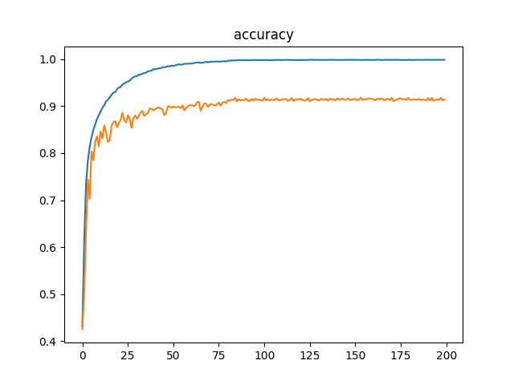
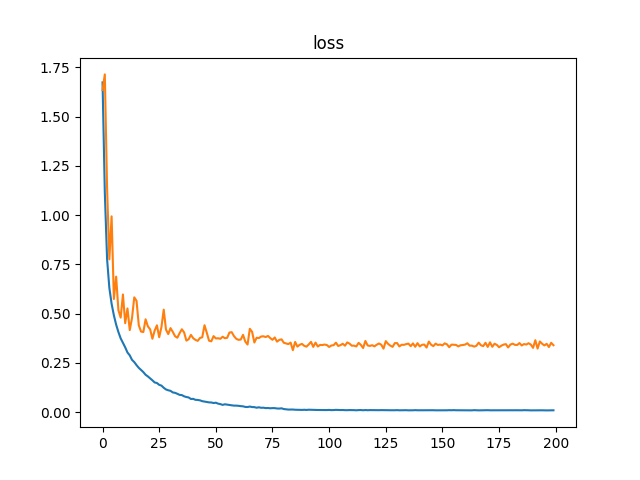

SqueezeNet[[1](https://arxiv.org/abs/1602.07360)]の、Kerasでの実装です。たぶん、もっともシンプルなコードなんじゃないかと。

# Usage

## 準備

~~~ bash
$ pip3 install --upgrade tensorflow-gpu keras funcy matplotlib h5py
~~~

## 訓練

~~~ bash
$ python3 -m try_squeeze_net.train
~~~

## 訓練結果の確認

~~~ bash
$ python3 -m try_squeeze_net.check
~~~

私が試した結果だと、cifar10の精度は93.05%になりました。

# Notes

* ごめんなさい。TensorFlow環境でしか試していません。
* [https://github.com/nutszebra/squeeze_net](https://github.com/nutszebra/squeeze_net)を参考にして作成しています。私の能力だと、論文だけでは作れませんでした……。
* 検証には、ImageNetではなくcifar10を使用しました。
* [[2](https://arxiv.org/abs/1603.05027)]のバッチ・ノーマライゼーション→ReLU→畳込みの順序を使用しました。
* Kerasに関数型プログラミングのテクニックを適用する方法は、[Kerasと関数型プログラミングで、楽ちんに深層学習してみた](https://tail-island.github.io/programming/2017/10/13/keras-and-fp.html)にまとめました。

# References

* SqueezeNet: AlexNet-level accuracy with 50x fewer parameters and <0.5MB model size [[1](https://arxiv.org/abs/1602.07360)]
* Identity Mappings in Deep Residual Networks [[2](https://arxiv.org/abs/1603.05027)]
