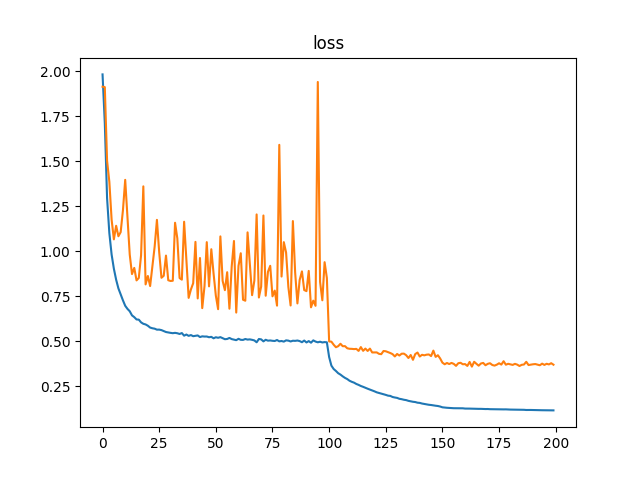
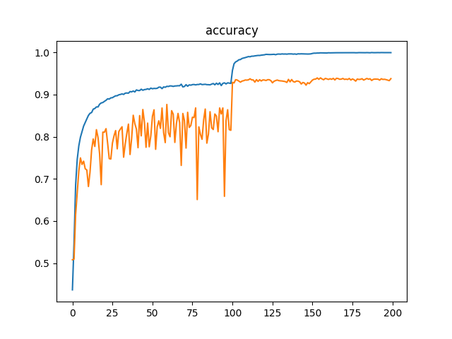

SqueezeNet[[1](https://arxiv.org/abs/1602.07360)]の、Kerasでの実装です。たぶん、もっともシンプルなコードなんじゃないかと。

# Usage

## 準備

~~~ bash
$ pip3 install --upgrade tensorflow-gpu keras funcy matplotlib h5py
~~~

## 訓練

~~~ bash
$ python3 train.py
~~~

## 訓練結果の確認

~~~ bash
$ python3 check.py
~~~

私が試した結果だと、CIFAR-10の精度は93.77%になりました。論文にはCIFAR-10の精度がないので分からないけど、かなり高い精度なので、多分コードは大丈夫だと思います。

# Notes

* ごめんなさい。Python3とTensorFlowの環境でしか試していません。
* [https://github.com/nutszebra/squeeze_net](https://github.com/nutszebra/squeeze_net)と[https://github.com/takedarts/resnetfamily](https://github.com/takedarts/resnetfamily)を参考にして作成しています。
* 検証には、ImageNetではなくCIFAR-10を使用しました。
* [[2](https://arxiv.org/abs/1603.05027)]のバッチ・ノーマライゼーション→ReLU→畳込みの順序を使用しました。
* Kerasに関数型プログラミングのテクニックを適用する方法は、[Kerasと関数型プログラミングを使えば、深層学習（ディープ・ラーニング）は楽ちんですよ](https://tail-island.github.io/programming/2017/10/25/keras-and-fp.html)にまとめました。

# References

* SqueezeNet: AlexNet-level accuracy with 50x fewer parameters and <0.5MB model size [[1](https://arxiv.org/abs/1602.07360)]
* Identity Mappings in Deep Residual Networks [[2](https://arxiv.org/abs/1603.05027)]
